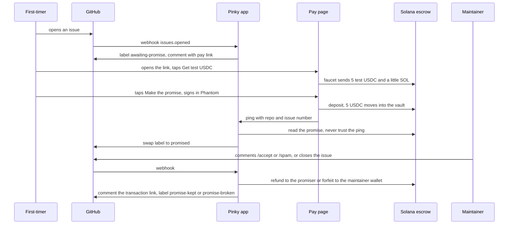
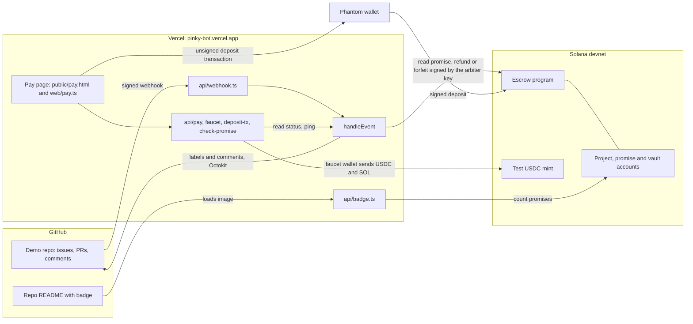

# Pinky

Pinky promise this isn't spam.

## What

Pinky is a GitHub App and a small Solana escrow program. When a first-time contributor opens an issue or PR, Pinky asks for a refundable promise of 5 USDC. A maintainer closes the issue or comments `/accept`, and the money goes back. A maintainer comments `/spam`, and the money goes to the project's maintainer wallet.

It runs on Solana devnet with a test USDC mint, on one demo repo, [sivaratrisrinivas/pinky-demo](https://github.com/sivaratrisrinivas/pinky-demo). It does not handle real money.

## Why

Opening an issue or a PR costs nothing, and reading one costs a maintainer minutes. AI-generated PRs and slop issue reports have pushed that imbalance past what many maintainers can absorb. A script that opens 40 PRs before breakfast looks the same as a newcomer who cares.

Maintainers are left with two bad options. They read everything and burn time, or they close everything from strangers and turn away real newcomers. Pinky adds a third. A stranger stakes a small refundable amount on not being spam. A real contributor gets it back and loses nothing. A spammer pays for the time they cost.

## How

1. A first-timer opens an issue or PR. Pinky labels it `awaiting-promise` and comments a pay link.
2. The first-timer opens the link, taps "Get test USDC" and then "Make the promise". The label becomes `promised` once the promise exists on-chain.
3. A maintainer with write access closes the issue, merges the PR or comments `/accept`. The promise is kept and the money goes to the wallet that paid.
4. If the maintainer comments `/spam`, the promise is broken and the money goes to the maintainer wallet.
5. Pinky comments the transaction link either way, and the label ends as `promise-kept` or `promise-broken`.

Anyone can pay a first-timer's link, so an existing contributor can vouch for a newcomer. The refund goes to whoever paid. Collaborators, members and returning contributors are never asked, and repos that aren't set up as projects are ignored.



### Trust model

In v1 the app holds one arbiter keypair and signs every verdict for the maintainer. A leaked key could settle any open promise, but the program limits the arbiter to picking the outcome.

- A kept promise is paid only to the token account that paid the promise.
- A broken promise is paid only to the project's maintainer wallet.
- A settled promise can't be settled again, so the first verdict is final.
- The pay page's ping carries no proof. The app reads the chain and acts only on what it finds.

A promiser can also take back an open promise after 30 days with `reclaim`, so an absent maintainer can't lock money forever. In v2 the maintainer's own wallet would sign verdicts.

## High level architecture



The app has one entry point, `handleEvent` in `src/handle-event.ts`. It reaches the outside world through two ports, `Github` and `Chain`, and the tests use in-memory fakes of both. The real adapters are Octokit in `src/github.ts` and a Solana client in `src/chain.ts`.

| Part | Where | Job |
| --- | --- | --- |
| Escrow program | `escrow/` | `init_project`, `deposit`, `refund`, `forfeit` and `reclaim`. Holds the money in a vault per project. |
| GitHub App | `api/webhook.ts`, `src/` | Asks first-timers, flips labels, settles on verdicts. |
| Pay page | `public/pay.html`, `web/pay.ts`, `api/` | Faucet, deposit transaction, ping. |
| Badge | `api/badge.ts` | Serves "Pinky-protected: N promises, M broken" from the chain counts. |

Three keys matter.

| Key | Held by | Used for |
| --- | --- | --- |
| Arbiter | The GitHub App, in `ARBITER_SECRET_KEY` on Vercel | Signs `refund` and `forfeit` |
| Faucet wallet | The operator, in `FAUCET_SECRET_KEY` | Funds the faucet with test USDC and devnet SOL |
| Promiser wallet | The first-timer, in Phantom | Signs the `deposit` that makes the promise |

## Getting started

### Try the demo

1. In Phantom, turn on Testnet Mode and pick Solana Devnet. Otherwise Phantom simulates on mainnet and rejects the transaction with "Blockhash not found".
2. From a GitHub account that isn't a collaborator, open an issue on [sivaratrisrinivas/pinky-demo](https://github.com/sivaratrisrinivas/pinky-demo). Within seconds it gets the `awaiting-promise` label and a comment with a pay link.
3. Open the link, connect Phantom, tap "Get test USDC" and then "Make the promise". The label changes to `promised`.
4. As the repo owner, comment `/accept` or `/spam` on the issue, or close it. The bot replies with an explorer link.

### Run it yourself

You need Node, Rust, the Solana CLI, Anchor 1.2, the Vercel CLI and a GitHub account.

```bash
npm install
npm test             # 109 tests for the app
npm run typecheck

cd escrow
npm install
npm test             # 12 tests on a local validator
```

To set up your own project:

1. Run `scripts/setup-github-app.sh`. It creates the demo repo, the GitHub App, the arbiter and faucet keypairs and a `.env`.
2. Deploy the program and register the repo as a project.

   ```bash
   cd escrow
   anchor deploy --provider.cluster devnet     # about 3 devnet SOL
   npm run setup-project -- <owner>/<repo>     # test USDC mint, arbiter key and project
   npm run smoke                               # one keep and one break, prints two explorer links
   ```

3. Set `GITHUB_APP_ID`, `GITHUB_APP_PRIVATE_KEY_BASE64`, `GITHUB_WEBHOOK_SECRET`, `ARBITER_SECRET_KEY` and `FAUCET_SECRET_KEY` on a Vercel project. Turn off Deployment Protection, or GitHub gets a login page instead of the webhook.
4. Deploy from the repo root.

   ```bash
   vercel deploy --prod --yes
   ```

5. Set the App's webhook URL to `https://<your-project>.vercel.app/api/webhook`.

Add the badge to a project's README with ``.

The vocabulary is in [GLOSSARY.md](GLOSSARY.md), and the design decisions are in [docs/adr](docs/adr).
