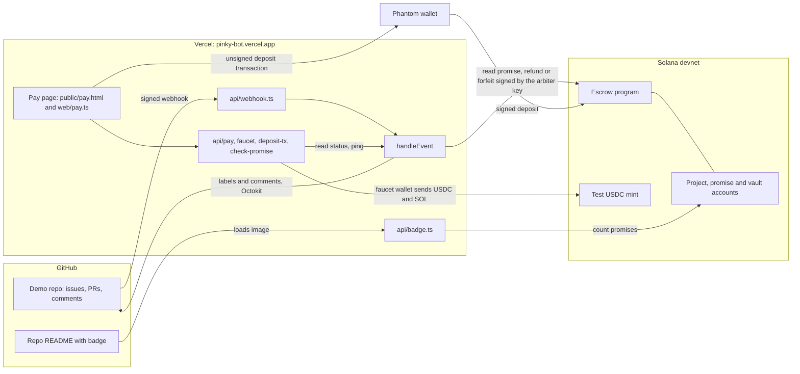
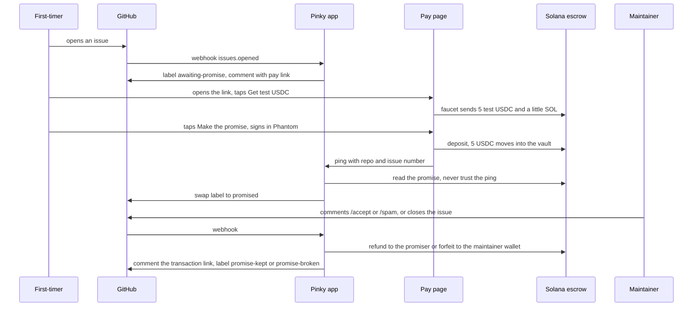

# Pinky

Pinky promise this isn't spam.


Pinky is a GitHub App and a small Solana escrow program. When a first-time contributor opens an issue or PR, Pinky asks for a refundable promise of 5 USDC. The maintainer closes the issue or comments `/accept` and the money goes back. The maintainer comments `/spam` and the money goes to the project's maintainer wallet.

It runs on Solana devnet with a test USDC mint, on one demo repo, [sivaratrisrinivas/pinky-demo](https://github.com/sivaratrisrinivas/pinky-demo). It does not handle real money.

## Why

Opening an issue or a PR costs nothing, and reading one costs a maintainer minutes. AI-generated PRs and slop issue reports have pushed that imbalance past what many maintainers can absorb. A script that opens 40 PRs before breakfast looks the same as a newcomer who cares.

Maintainers end up with two bad options. They read everything and burn time, or they close everything from strangers and turn away real newcomers. Pinky adds a third. A stranger stakes a small refundable amount on not being spam. A real contributor gets it back and loses nothing. A spammer pays for the time they cost.

## What it does

1. A first-timer opens an issue or PR. Pinky labels it `awaiting-promise` and comments a friendly pay link.
2. The first-timer opens the link, signs in, taps "Get test USDC" and then "Make the promise". The label becomes `promised` once the promise exists on-chain.
3. A maintainer with write access closes the issue, merges the PR or comments `/accept`. The promise is kept and the money goes to the wallet that paid.
4. If the maintainer comments `/spam`, the promise is broken and the money goes to the maintainer wallet.
5. Pinky comments the transaction link either way, and the label ends as `promise-kept` or `promise-broken`.

Anyone can pay a first-timer's link, so an existing contributor can vouch for a newcomer. The refund goes back to whoever paid ([ADR 0002](docs/adr/0002-promises-belong-to-wallets-not-github-users.md)). Collaborators, members and returning contributors are never asked. Repos that aren't set up as projects are ignored.

The vocabulary is in [GLOSSARY.md](GLOSSARY.md): project, maintainer, first-timer, promiser, promise, kept, broken, verdict, maintainer wallet, arbiter.

## How it works

### Architecture



The app has one entry point, `handleEvent` in `src/handle-event.ts`. It reaches the outside world through two ports, `Github` and `Chain`. Tests use in-memory fakes of both. The real adapters are Octokit in `src/github.ts` and a Solana client in `src/chain.ts`.

Three keys matter:

| Key | Held by | Used for |
| --- | --- | --- |
| Arbiter | The GitHub App, in `ARBITER_SECRET_KEY` on Vercel | Signs `refund` and `forfeit` |
| Faucet wallet | The operator, in `FAUCET_SECRET_KEY` | Funds the faucet endpoint with test USDC and devnet SOL |
| Promiser wallet | The first-timer, in Phantom | Signs the `deposit` that makes the promise |

### One promise, end to end



### Trust model

In v1 the app holds one arbiter keypair and signs every verdict on behalf of a maintainer who comments or closes ([ADR 0001](docs/adr/0001-app-holds-the-arbiter-key.md)). A leaked key could settle any open promise, but the program limits what the arbiter can do. It picks the outcome and nothing else.

- A kept promise is paid only to the token account that paid the promise.
- A broken promise is paid only to the project's maintainer wallet.
- A settled promise can't be settled again, so the first verdict is final.
- Both destinations come from stored accounts, never from the caller.
- The check-promise ping carries no proof. The app reads the chain and acts only on what it finds.

In v2 the maintainer's own wallet would sign. Separately, `reclaim` lets a promiser take back an open promise after 30 days without any arbiter, so an absent maintainer can't lock money forever.

## Status

Tickets #2 to #11 are closed and the full journey has run live on devnet. The details are in the ticket comments, and the spec is [#1](https://github.com/sivaratrisrinivas/pinky/issues/1).

| Piece | Where it ran | Ticket |
| --- | --- | --- |
| Escrow program with keep and break | Devnet, smoke script prints both links | [#2](https://github.com/sivaratrisrinivas/pinky/issues/2) |
| Demo repo, GitHub App, keys, deploy secrets | Done by `scripts/setup-github-app.sh` | [#3](https://github.com/sivaratrisrinivas/pinky/issues/3) |
| Ask first-timers for a promise | Live on the demo repo | [#4](https://github.com/sivaratrisrinivas/pinky/issues/4) |
| Verdicts from `/accept`, `/spam`, closes and merged PRs | Live on the demo repo | [#5](https://github.com/sivaratrisrinivas/pinky/issues/5) |
| Pay page with faucet | Live at `/pay` with the Phantom extension | [#6](https://github.com/sivaratrisrinivas/pinky/issues/6) |
| Ping flips the label, late deposits are kept | Live, no manual ping | [#7](https://github.com/sivaratrisrinivas/pinky/issues/7) |
| README badge | Live, counts move after a promise and a `/spam` | [#8](https://github.com/sivaratrisrinivas/pinky/issues/8) |
| Seeded demo issues | Ten issues, #10 to #19 on the demo repo | [#9](https://github.com/sivaratrisrinivas/pinky/issues/9) |
| `reclaim` after 30 days | Anchor tests, program upgraded on devnet | [#10](https://github.com/sivaratrisrinivas/pinky/issues/10) |
| Five full journeys, no code change | Demo repo issues #20 to #24 | [#11](https://github.com/sivaratrisrinivas/pinky/issues/11) |

Two things have not run. Email sign-in is unverified, because Phantom's developer portal stopped taking new accounts on 2026-10-08 and there is no `PHANTOM_APP_ID`. Every live run used the Phantom browser extension. And no `reclaim` has run on devnet yet, since it needs a promise older than 30 days.

## Repo layout

```
escrow/                  Anchor program, tests and operator scripts
  programs/escrow/       init_project, deposit, refund, forfeit, reclaim
  tests/                 behaviour tests on a local validator
  scripts/               setup-project, smoke, promise, fund-faucet
api/webhook.ts           verifies the GitHub webhook and calls handleEvent
api/pay.ts, faucet.ts, deposit-tx.ts, check-promise.ts   functions behind the pay page
api/badge.ts             the README badge, served at /badge.svg
web/pay.ts               pay page client, bundled into public/pay.js by npm run build
public/pay.html          the pay page, served at /pay
src/                     handleEvent, its ports and the real adapters
scripts/                 setup-github-app.sh, pay-e2e.ts, seed-issues.ts
docs/adr/                architecture decisions
GLOSSARY.md              the vocabulary
PLAN.md                  the original build plan
```

## Escrow program

Program ID `2nAVrgq7xYseUPES5ZUxfQ2pKcyWkiRJNxbgAWca7FCU`, deployed on devnet.

| Instruction | Signer | Effect |
| --- | --- | --- |
| `init_project(repo_id, amount, arbiter)` | operator | Creates the project for a GitHub repo ID and its vault. Stores the arbiter, mint, maintainer wallet and promise amount. |
| `deposit(issue_number)` | promiser | Creates the promise for one issue or PR number and moves the amount into the vault. Fails if one exists. |
| `refund` | arbiter | Keeps the promise. Vault to the promiser's token account. |
| `forfeit` | arbiter | Breaks the promise. Vault to the maintainer wallet. |
| `reclaim` | promiser | Takes back an open promise more than 30 days old and marks it kept. Fails on a younger or settled promise and for any other signer. |

Accounts are program-derived addresses. The project comes from `["project", repo_id]`, the promise from `["promise", project, issue_number]` and the vault from `["vault", project]`. Settled promises stay on-chain as `Kept` or `Broken`, so the app can read them for "already settled" replies and the badge counts.

Limits in v1:

- `init_project` is permissionless. Anyone could create a project for a repo ID first, so the app checks that a project names its own arbiter before trusting it.
- A refund fails for good if the promiser closes their token account after depositing. The promise can then only be broken.

### Develop and deploy

You need Rust, the Solana CLI, Anchor 1.2 and Node. Anchor 1.2 defaults to surfpool for tests, so `npm test` sets `ANCHOR_TEST_VALIDATOR=legacy` to use `solana-test-validator`.

```bash
cd escrow
npm install
npm test             # builds, then runs 12 tests on a local validator
npm run typecheck
```

The tests call the instructions the way a client would and check balances and promise state. They cover keep, break, duplicate promises, double settlement, non-arbiter signers, vouching, redirected destinations, cross-project substitution and `reclaim`.

A local validator can't move its clock. The 30-day `reclaim` tests load three open promises that are already old, from `tests/fixtures/aged-*.json` listed in `Anchor.toml`. Run `npm run fixtures` to regenerate them if the `Promise` layout changes.

```bash
cd escrow
anchor deploy --provider.cluster devnet     # about 3 devnet SOL
npm run setup-project -- <owner>/<repo>     # test USDC mint, arbiter key and project, safe to re-run
npm run smoke                               # one keep and one break on devnet, prints two explorer links
npm run promise -- <issue-number>           # a 5 test USDC promise for a real demo issue
```

If a new build is larger than the deployed program, run `solana program extend <program-id> <bytes> --url devnet` first. The `reclaim` upgrade needed 10240 more bytes.

Keys and the generated `devnet.json` live in `escrow/.keys/` and are gitignored. The demo project is `sivaratrisrinivas/pinky-demo`, repo ID 1407786691, with test USDC mint `BATkjUKVJzLi3YNT7wKvmA6Eh3rkN9wuCpgCNnzL9Wn3`.

## GitHub App

The bot is one Vercel function at `https://pinky-bot.vercel.app/api/webhook`. GitHub sends it `issues`, `pull_request` and `issue_comment` events. The function checks the `X-Hub-Signature-256` header against `GITHUB_WEBHOOK_SECRET`, answers 401 on a bad signature, drops other events and calls `handleEvent`. `handleEvent` acts only on repos that are projects on-chain.

**Ask.** On `issues.opened` or `pull_request.opened` by an author with association `NONE`, `FIRST_TIMER` or `FIRST_TIME_CONTRIBUTOR`, it adds `awaiting-promise` and posts the comment with the pay link `https://pinky-bot.vercel.app/pay?repo=<owner>%2F<name>&n=<number>`. Everyone else is ignored.

**Settle.** A verdict is `/accept` or `/spam` on a line of its own, or closing an issue, or closing or merging a PR. Comments from bots are ignored, which includes the app's own.

| Situation | Result |
| --- | --- |
| Command from someone without write access | A short reply and no chain call. |
| Close by someone without write access | Nothing. A first-timer closing their own issue is not a verdict. |
| Open promise | `/accept` or a close keeps it, `/spam` breaks it. The bot comments the explorer link and sets `promise-kept` or `promise-broken`. |
| Settled promise, by command | "This promise was already kept" or "broken", with the first link. No chain call. |
| Settled promise, by close | Nothing. Closing after `/spam` is normal. |
| No promise | Only `awaiting-promise` is removed. |
| Two verdicts race | The second settle fails on-chain with `PromiseSettled`. The app re-reads the promise and treats it as already settled. |

| Port | Methods | Real adapter |
| --- | --- | --- |
| `Github` | `addLabel`, `removeLabel`, `comment`, `hasWriteAccess`, `isOpen` | `src/github.ts`, Octokit with an installation token |
| `Chain` | `readProject`, `readPromise`, `countPromises`, `settle` | `src/chain.ts`, decodes accounts over RPC and signs with the arbiter key |

`readProject` returns null when the account is missing, is not a `Project`, or names another arbiter. `settle` rebuilds the instruction from the stored accounts, so the destination is the promiser's token account for kept and the maintainer wallet for broken. The settlement link is the latest successful transaction on the promise account.

```bash
npm install
npm test          # 109 tests
npm run typecheck
```

### Deploy

```bash
vercel deploy --prod --yes     # from the repo root
```

Set `GITHUB_APP_ID`, `GITHUB_APP_PRIVATE_KEY_BASE64`, `GITHUB_WEBHOOK_SECRET` and `ARBITER_SECRET_KEY` on the Vercel project. The pay page also needs `FAUCET_SECRET_KEY`. `RPC_URL` is optional and defaults to the public devnet endpoint. Three things broke the first deploy:

- Deployment Protection must be off, or GitHub gets a login page instead of the function.
- `.vercelignore` keeps `escrow/`, `scripts/` and `docs/` out of the upload. A local test validator leaves a socket file in `escrow/.anchor/` that the Vercel CLI can't upload.
- `package.json` pins `uuid` to 9.x through `overrides`. `@solana/web3.js` 1.x pulls an ESM-only `uuid` that crashes on cold start.

## Pay page

`/pay?repo=<owner>/<name>&n=<number>` is where the bot's link lands. It shows the issue and the amount, then offers sign-in, "Get test USDC", "Make the promise" and an explorer link.

| Function | What it does |
| --- | --- |
| `GET /api/pay` | Returns `ready`, `closed`, `promised`, `unknown-issue` or `not-a-project`. The page shows a pay button only for `ready`. |
| `POST /api/faucet` | Tops a wallet up to 5 test USDC and 0.01 devnet SOL and creates its token account. Asking again sends nothing. |
| `POST /api/deposit-tx` | Re-checks the status and returns an unsigned `deposit` transaction. The browser signs it and sends it to devnet. |
| `POST /api/check-promise` | The ping after a promise. It takes `{ repo, n }` and answers `{ ok: true, found }`. |

After the promise confirms, the page pings `/api/check-promise`. The app then reads the project and the promise from the chain.

| Chain says | Result |
| --- | --- |
| No promise | Nothing changes. |
| Open promise, issue open | `awaiting-promise` becomes `promised`. |
| Open promise, issue closed | The late promise is kept at once. The bot comments the link and sets `promise-kept`. |
| Settled promise | Nothing changes, so a forged ping can't undo a verdict. |

The app reads at `confirmed` and can lag the page by a moment. `pingUntilFound` in `src/ping.ts` pings again after 1, 3 and 10 seconds until `found` is true, then gives up quietly.

### Sign-in

Without `PHANTOM_APP_ID` the page offers only the Phantom browser extension, and nothing pretends to be email sign-in. With an ID it also offers Google sign-in. To finish the email gap:

1. Create an app at https://phantom.com/portal. Allow the origin `https://pinky-bot.vercel.app` and the redirect `https://pinky-bot.vercel.app/pay`.
2. Set `PHANTOM_APP_ID` on Vercel and redeploy. No code change is needed.
3. Run `cd escrow && npm run fund-faucet` to mint 1000 test USDC into the faucet wallet. The faucet wallet needs devnet SOL too.

In Phantom, turn on Testnet Mode and pick Solana Devnet. Otherwise Phantom simulates the transaction on mainnet and rejects it with "Blockhash not found".

`npm run pay-e2e -- <owner/repo> <issue>` plays the page with a throwaway wallet. It needs `.env` and makes a real promise on that issue.

## Badge

`GET /badge.svg?repo=<owner>/<name>` returns an SVG reading "Pinky-protected: N promises, M broken". N counts every promise made for the project, open ones included. M counts the broken ones. Both come from `countPromises` on the chain. A repo that isn't a project gets a grey "not set up" badge with status 200, so a README image never breaks. Responses are cached for 60 seconds. Add it to a README with:

```markdown

```

`countPromises` calls `getProgramAccounts` on the public RPC, filtered by account size and project address. That is fine for one project and would need an index for many.

## Seeded demo issues

`npm run seed-issues` opens ten realistic issues on the demo repo from test GitHub accounts, so the repo looks used. They are not reports from real users, and the demo repo's README says so.

```bash
SEED_GITHUB_TOKENS=ghp_aaa,ghp_bbb   # test accounts with public_repo scope, not the owner, not collaborators
SEED_OWNER_TOKEN=$(gh auth token)    # optional, adds the "seeded" note to the demo README

npm run seed-issues -- --dry-run     # lists what it would open
npm run seed-issues                  # opens them, then waits for each label and bot comment
```

A title that already exists is skipped, so a re-run opens only what is missing. The script exits non-zero if an issue doesn't get the label and the bot comment within a minute. The run on 2026-10-09 used one account, `askubusku18-dum`, so all ten issues come from it.

## Known limits

- Email sign-in is unverified. See the Sign-in section.
- A webhook retry after a failed comment can post the comment twice. Nothing checks for an existing label first.
- The settlement link comes from the last 10 transactions on the public RPC. A promise whose history the RPC can't serve gets the "already kept" reply without a link.
- The comment says "5 USDC" as fixed text. The amount lives on the project account.
- The faucet has no rate limit, and two simultaneous calls for one wallet can both send. It is devnet money, but the faucet wallet's SOL is finite.
- Nothing posts a label or comment after `reclaim`, so the issue keeps `promised`.
- Each pay-page status check makes three GitHub calls to find the repo ID and the issue state.

## Not in v1

Mainnet or real USDC, more than one project, GitHub sign-in on the pay page, a `/cosign` command, and maintainers signing their own verdicts.
